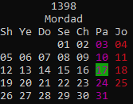

# pcal
A pure bash _(no external commands)_ command line tool to convert Gregorian calendar dates to Persian calendar dates. Based on [jalaali-js](https://github.com/jalaali/jalaali-js)


# Getting Started
Pipe Gregorian calendar dates in `YYYY-MM-DD` format to `pcal` to get that date in Persian calendar.

## examples
If you have put `pcal` somewhere in your path:
```shell
echo "2019-07-26" | pcal #1398-05-04
```
Or if it is not in your path:
```shell
echo "2019-07-26" | /path/to/pcal #1398-05-04
```
To use a different output delimiter:
```shell
echo "2019-07-26" | pcal -D / #1398/05/04
```
To use a different input delimiter:
```shell
echo "2019/07/26" | pcal -d / #1398-05-04
```
To convert persian date to gregorian date:
```shell
echo 1398-05-04 | pcal -g #2019-07-26
```
Current persian date:
```shell
pcal -t #1398-05-17
```
Display a calendar (current month) :
```shell
pcal -m
```


# License
This project is licensed under the MIT License - see the [LICENSE](LICENSE) file for details

